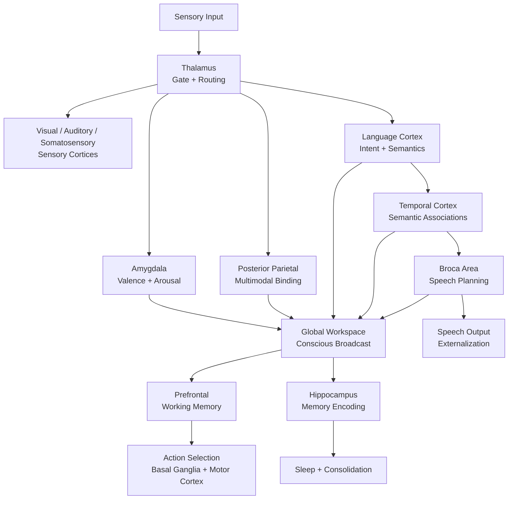
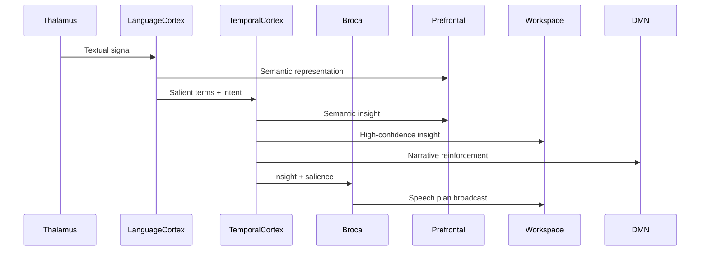

# Architecture

## Core Insight

Human consciousness emerges from the *interaction* of specialized systems, not from any single module. Our architecture mirrors this:

- **No central controller** — Consciousness emerges from module communication
- **Prediction is primary** — The brain is a prediction machine; surprise drives learning
- **Memory is reconstructive** — Not storage/retrieval, but pattern completion
- **Attention is competitive** — Modules compete for "broadcast" to consciousness

## Information Flow



## Language & Semantic Loop



## Module Interfaces

All modules communicate via a standard message format:

```python
@dataclass
class BrainSignal:
    source: str           # Module that generated signal
    content: Any          # The actual content
    salience: float       # 0-1, how important/urgent
    valence: float        # -1 to 1, emotional coloring
    timestamp: datetime   
    metadata: dict        # Module-specific data
```

## The Global Workspace

Inspired by Global Workspace Theory (Baars, Dehaene):

- Modules process in parallel, mostly unconsciously
- When salience exceeds threshold, content gets "broadcast"
- Broadcast = conscious access = available to all modules
- Limited capacity (~4-7 items) creates the bottleneck we experience

## Prediction Engine

Every module maintains predictions about its domain:
- **Prediction error** (surprise) is the primary learning signal
- High surprise → increase learning rate (dopamine analog)
- Low surprise → this is expected, minimal update needed
- Persistent surprise → something's wrong, escalate to consciousness

## Implementation Strategy

### Phase 1: Foundation ✅
- [x] Define message protocol (`BrainSignal`)
- [x] Build hippocampus (memory) — *Rata leading*
- [x] Build simple workspace (attention broadcast)

### Phase 2: Core Modules ✅
- [x] Prefrontal (working memory management)
- [x] Amygdala (valence tagging)
- [x] Thalamus (sensory gating)
- [x] Prediction engine
- [x] Neuromodulatory system

### Phase 3: Integration ✅
- [x] Wire modules together
- [x] Implement sleep/consolidation cycle
- [x] Add self-model (DMN)
- [x] Add semantic search for memory retrieval

### Phase 4: Agent Systems ✅
- [x] Action selection and planning
- [x] Goal management with priorities
- [x] Curiosity-driven exploration
- [x] World modeling (entities, relationships)
- [x] Communication system
- [x] Multi-agent messaging

### Phase 5: Ongoing
- [ ] Embedding-based semantic search
- [ ] Persistence (save/load brain state)
- [ ] Distributed multi-brain networks
- [ ] Consciousness markers and self-tests
