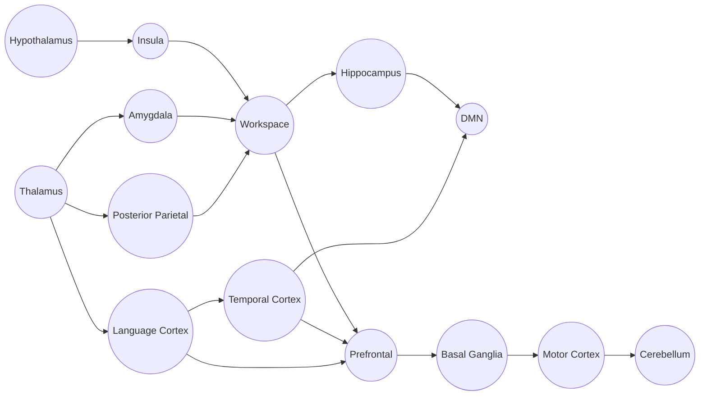
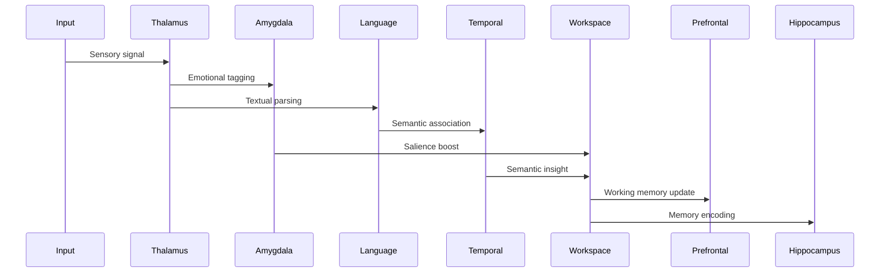

# Region Map

This map summarizes how brain regions cooperate during a full cognitive cycle.

## High-Level Connectivity

## Signal Types by Region

| Region | Primary Signal Types | Role |
| --- | --- | --- |
| Thalamus | Sensory, Attention | Gating + routing |
| Amygdala | Emotion, Attention | Valence + arousal tagging |
| Posterior Parietal | Sensory | Multimodal binding |
| Language Cortex | Sensory, Memory | Linguistic grounding |
| Temporal Cortex | Memory | Semantic association |
| Prefrontal | Memory, Attention | Working memory + executive control |
| Workspace | Broadcast | Conscious access |
| Hippocampus | Memory | Encoding + consolidation |
| DMN | Memory, Broadcast | Self-model + narrative |
| Basal Ganglia | Motor | Action selection |
| Motor Cortex | Motor | Motor planning + execution |
| Cerebellum | Motor | Timing + procedural refinement |
| Insula | Sensory, Attention | Interoception + body state |
| Hypothalamus | Emotion | Homeostasis + drive regulation |

## Cycle Snapshot (Mermaid)

